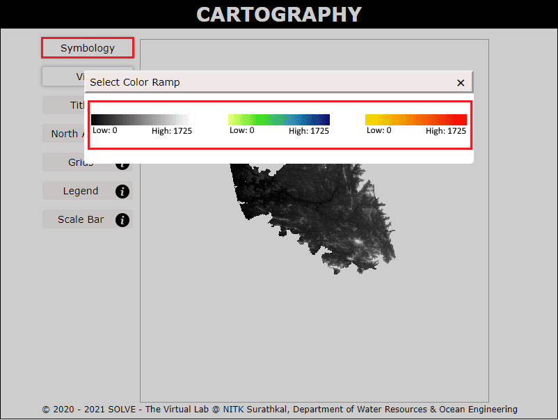
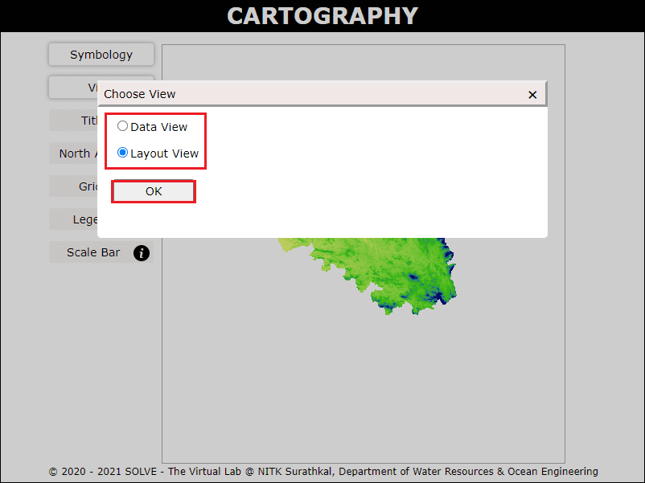
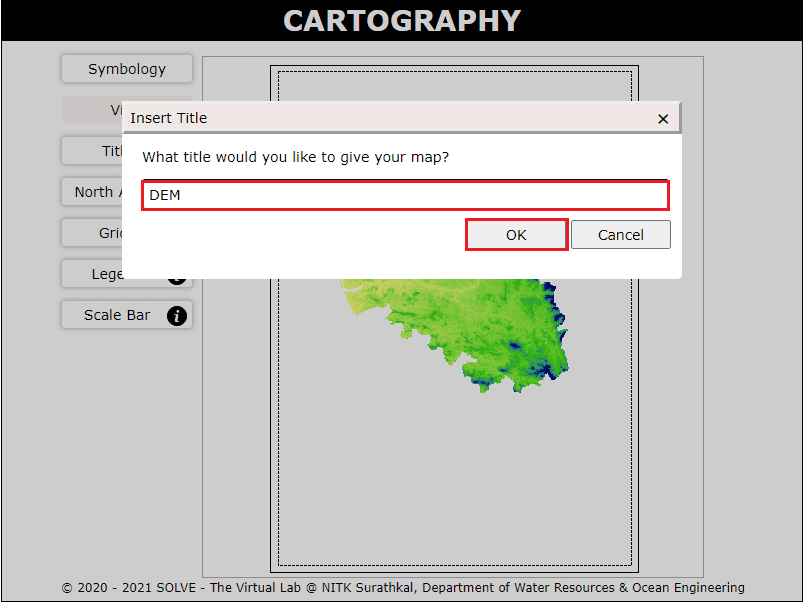
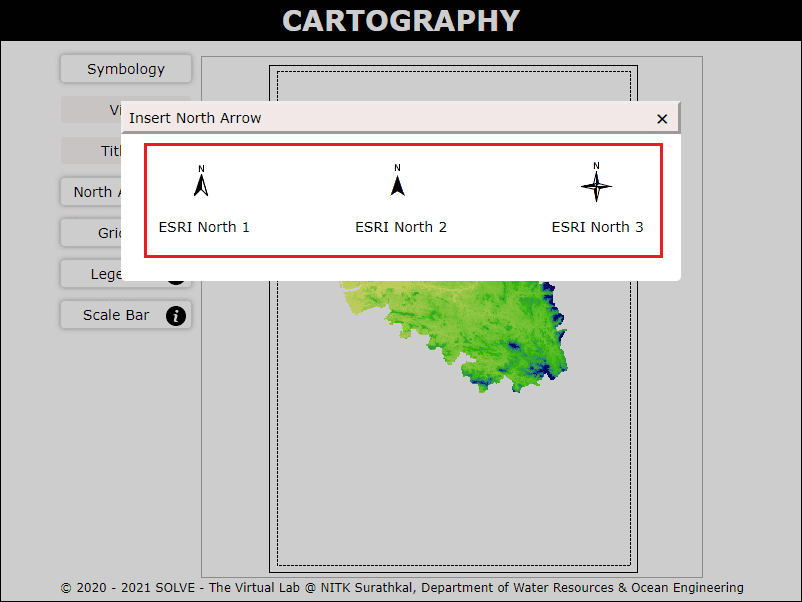
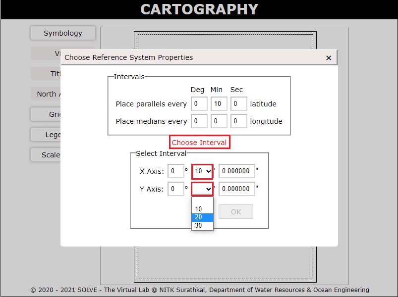
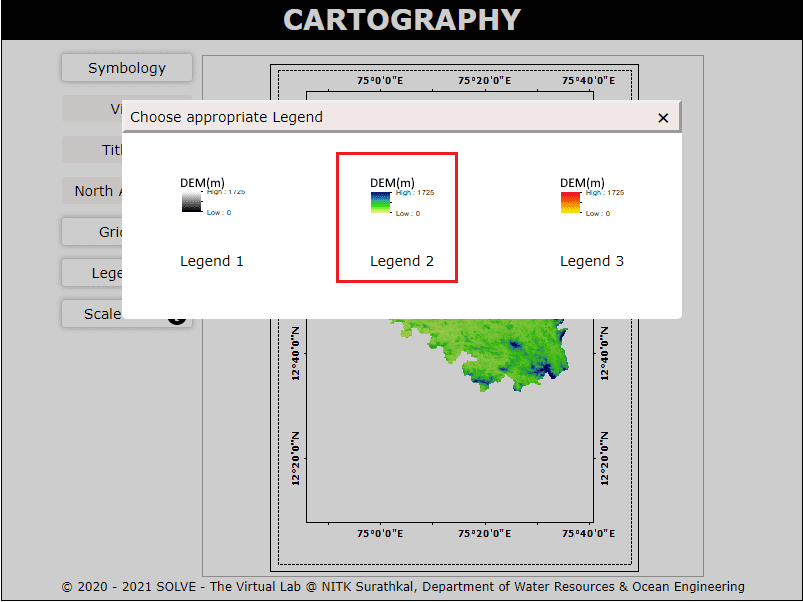
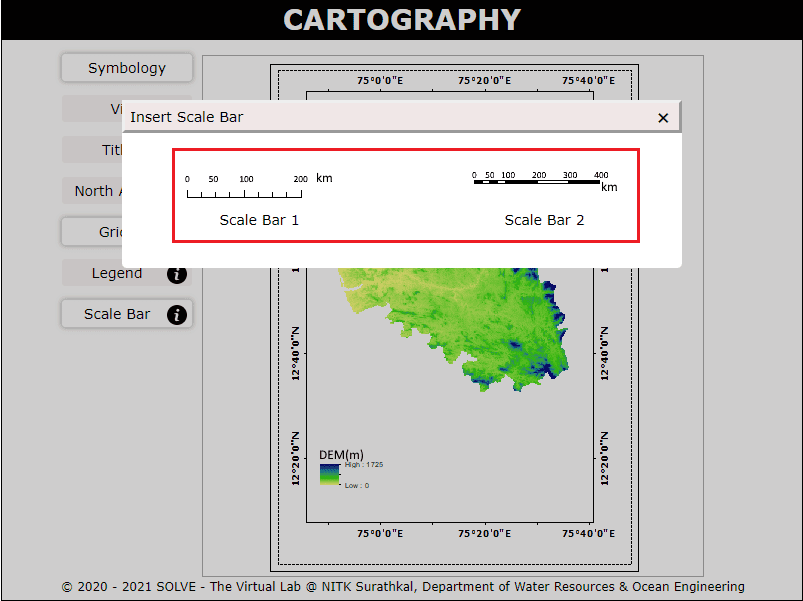
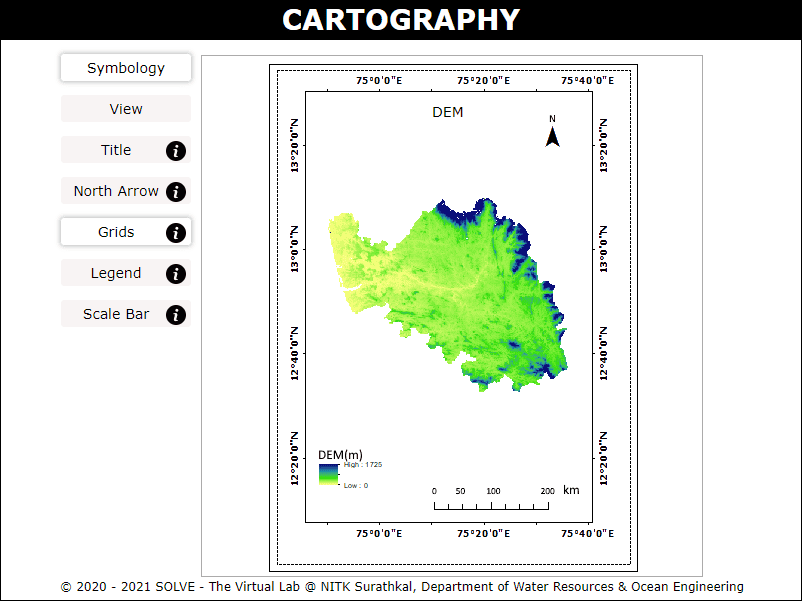

#### These procedure steps will be followed on the simulator

1. Open the Cartography experiment a window will open with objective, click on description tab to understand the terminology in the experiment, click on the NEXT button to proceed.  
  

2. Click on the Symbology tab to select either of the colour ramp provided to proceed.  
  

3. Click on the View tab to choose Layout View to proceed further.  
  

4. Click on Title tab to enter the title of your choiceand add it in the given map. Click on OK to proceed.  
  

5. Click on North Arrow tab to select the required north arrow and add it in the given map.  
  

6. Click on Grids tab to select the interval of X and Y Axis from the provided list, Click on OK to proceed.  
  

7. Click on Legend tab to add the legend in the map. Make sure that you select the legend based on the symbology selected.  
  

8. Click on the Scale Bar tab to select the required scale bar and add it in the given map.  
  

9. The final result is displayed once all the map elements are added to the map.  
  
