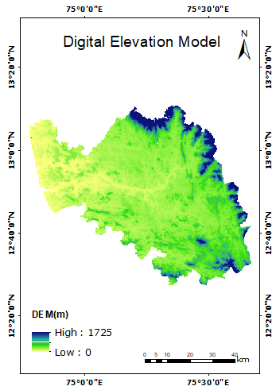

## INTRODUCTION 

Cartography is the study and practice of creating maps to communicate spatial, topographic and geographic information effectively. The traditional methods of mapmaking have now been replaced by digital systems capable of producing dynamic interactive maps that can be manipulated digitally. QGIS is one such software. Making maps requires the application of both scientific and artistic elements, combining graphic abilities and specialized knowledge of compilation and design principles with available product generation techniques. Maps serve as spatial data visualization tools. Spatial data is stored in a database and can be extracted for a number of reasons.

Cartography involves the superimposition of political, cultural, or other non geographical divisions onto the representation of a geographical area. The cartographic process has many stages, beginning with the need for a map and ending with its consumption by an audience. Conception begins with an environment, whether real or imagined. While gathering information about the subject, the cartographer considers how that information is structured and how that structure should inform the map's design. The cartographers then experiment with generalization, symbolization, typography, and other map elements to find ways to depict the information in such a way that the map reader can interpret the map as intended. The cartographer settles on a design and creates the map, whether in physical or electronic form, based on the results of these experiments. When completed, the map is delivered to its intended audience. The map reader interprets the symbols and patterns on the map in order to draw conclusions and possibly take action. Maps shape our perceptions of the world by providing spatial perspectives.

In the last decade, modern cartography, like many other fields of "information technology," has undergone rapid change. The cartographic process is concerned with data manipulation, data capture, image processing, and visual display rather than just drawing maps. Cartographic representations can be printed or displayed as dynamic images on a computer display screen. Computer-assisted mapping systems have added a new and exciting dimension to cartographic techniques, necessitating the addition of new skills to traditional methodologies. Cartography's fundamental nature has changed as technology has evolved, providing cartographers with new methods for visualizing and communicating spatial information.

**Elements of a Map**: The descriptions of cartographic elements that are commonly found on a map layout are listed below. Some maps include all eight elements, while others may only include a few of them.

- **Data Frame**: The data frame is the area of the map where the data layers are displayed. This section is the map's most important and central focus.

- **Legend**: The legend acts as a decoder for the data frame's symbology. As a result, it is also known as the key. Color schemata, symbology, and categorization are all explained in detail here. The color scheme on the map would be meaningless without the legend.

- **Title**: The title is important because it provides the viewer with a concise description of the map's subject matter right away. The title "Land-Use/Land-Cover Map, Dakshina Kannada" immediately informs the viewer of the data's subject matter and location.

- **North Arrow**: The north arrow serves as a guide for orientation. This allows the viewer to determine the map's orientation in relation to true north. Most maps are typically oriented with due north facing the top of the page. There are exceptions, and having the north arrow lets the viewer know which way the data is oriented.

- **Scale**: The scale explains how the data frame extent relates to the real world. A ratio is used in the description. This can be shown as a unit-to-unit comparison or as a measurement-to-measurement comparison. For example 1:10,000 in inches means that a measurement of one inch on the map equals 10,000 inches in real life. As a result, a scale of 1:10,000 means that each paper map unit represents 10,000 real-world units. A comparison of different unit types is the second method of depicting scale. For example, 1′′:100′ indicates that every inch measured on the paper map corresponds to 100 feet in the real world. This is the same as the 1:1200 ratio (1 foot = 12 inches).

- **Co-ordinates and Gridlines**: To know boundary extents and intermediate points.

